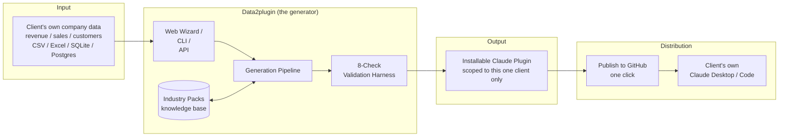
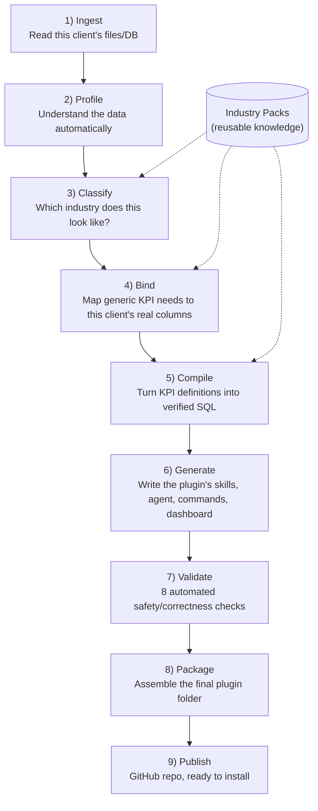
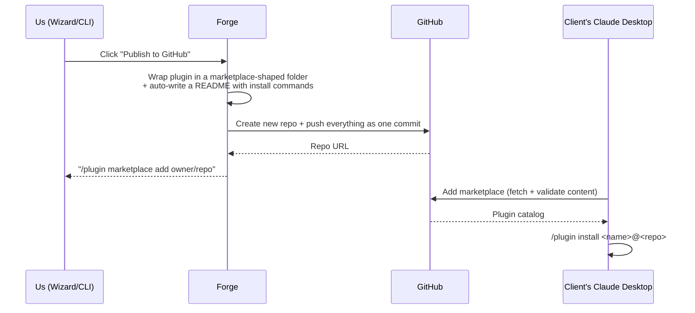

# Data2plugin — Project Plan

*A self-contained explanation of the problem, our proposed approach, how it will work, the phased plan to build it, and how to think about the risks — for a non-technical read-through.*

---

## 1. The problem we're solving

We want to offer this **to client companies**. A client would connect *their own* company data — revenue, sales, customer records, bookings, whatever their MIS holds — and get back a personalized Claude plugin. From then on, every question they ask Claude about their business ("what's our revenue this quarter", "show me the top accounts") should be answered live from *their* data, ideally with clear analytics and visualizations, not just text.

The naive way to build that is: for every client, someone manually writes a Claude plugin that knows that client's specific tables and columns. That doesn't scale — it's one bespoke engineering project per client, forever, and every improvement would have to be re-applied to every client's plugin by hand.

**What we propose to build instead is a factory, not a one-off plugin.** A client uploads their data file (or connects a database), and the system automatically produces a complete, ready-to-install Claude plugin scoped to *that client's own data only* — correct column names, correct business terminology, correct KPI formulas — in minutes, with no manual coding per client, and no mixing of one client's data with another's.

---

## 2. The core idea, in one sentence

> **Separate "what a KPI means" (industry knowledge, written once) from "where the data lives" (a specific client's schema, discovered automatically), and let a generic engine combine the two for any client, in any industry, automatically.**

Everything else in this plan exists to make that one idea safe, repeatable, and trustworthy enough to actually ship to a paying client.

---

## 3. Proposed architecture

We plan to build **three ways to drive the same engine** — a command-line tool, a REST API, and a web wizard — but with only **one pipeline implementation** underneath all of them, so nothing can end up working in the UI but not the CLI, or vice versa. Every run will be scoped to one client's data; nothing pooled or shared across clients.

---

## 4. How it will work, explained like a story

Think of it as an assembly line with nine stations. A client's dataset goes in one end; that client's own working plugin comes out the other.

1. **Ingest** — Accept CSV, TSV, Excel, JSON, Parquet, a SQLite file, a zip of several files, or a live read-only Postgres connection. Everything gets normalized through one query engine (DuckDB), so the rest of the pipeline never has to care what format the client's data started in.
2. **Profile** — Before knowing anything about the client's business, look at the data itself: what type is each column, which look like keys, how tables join, what a typical row looks like. Deterministic and free, with an optional AI pass on top adding plain-English business context (from column names and small capped samples only — never bulk client data).
3. **Classify** — Compare the profile against a library of **industry packs** (healthcare, retail, sales-pipeline, etc. — each just a folder of JSON files) and score how well each matches. Below a confidence threshold, the system should pause and ask a human to confirm — it must never silently guess wrong on real client data. A safe "generic analytics" fallback should always exist.
4. **Bind** — The reusability trick. An industry pack defines a KPI like "revenue" in **abstract terms** ("the column that plays the role of `revenue_amount`"), never in one client's actual column name. The binder's job is to figure out, for *this* client, which real column plays that role, using naming hints plus AI assistance for ambiguous cases. Anything unresolved should be skipped, never guessed.
5. **Compile** — Combine the resolved mapping with the pack's KPI *formula* to produce real, executable SQL, validated by a dedicated SQL parser before it ever runs. **The AI must never write SQL that ships to a client as-is** — it should only propose column mappings, which get compiled deterministically.
6. **Generate** — Write the plugin's actual content: a skill document, a specialist sub-agent, one slash-command per common report, a session-start guardrail, and a small HTML dashboard pre-computed from the client's real KPI numbers.
7. **Validate** — Nothing should reach a client without passing **eight independent automated checks** (see Section 7).
8. **Package** — Assemble everything into the exact folder structure Claude Code/Desktop expects, with sensitive columns automatically redacted before anything is bundled.
9. **Publish** — One click should create a client-specific GitHub repo and push the whole plugin as a single commit, with install instructions.

---

## 5. What will be inside a generated plugin

A common question: "will this just be a pile of JSON, or is there real code?" Both — deliberately. Every generated plugin will have the same nine kinds of pieces, every time:

| Piece | Location | What it is | Why it's needed |
|---|---|---|---|
| **Manifest** | `.claude-plugin/plugin.json` | Plugin name, version, author, file locations. | The one file Claude reads first to know what the plugin contains. |
| **Skill** | `skills/<pack>-analyst/SKILL.md` | A Markdown file describing when to use this plugin and what KPIs it knows about. | The plugin's table of contents for the assistant. |
| **Agent** | `agents/<pack>-analyst.md` | A specialist "deep-dive analyst" persona with a locked-down tool list. | For open-ended analysis, instructed to only ever answer using real tool calls and always cite its source. |
| **Commands** | `commands/<recipe>.md` | One slash-command per common report (e.g. `/quarterly-summary`). | One-click access to the reports clients will ask for most often. |
| **Hooks** | `hooks/hooks.json` | Guardrails that fire automatically at session start. | Deterministic, never AI-authored — controls what runs automatically, so it can't be left to chance. |
| **MCP server** | `.mcp.json` + `mcp_server/` | The plugin's only real executable code, generic and shared unchanged across every client. Will expose five tools: `describe_schema` (structure only, never row data), `get_kpi` (run a pre-validated KPI by id), `run_safe_query` (free-form SQL, but only after a guardrail chain: read-only, allowed tables only, no PII columns, row-limit/timeout enforced), `search_records` (constrained lookups, values always bound-parameterized), `get_data_profile` (data-quality stats). | Written once, tested once, reused for every client — never regenerated per client. |
| **Config data** | `config/*.json` | Four JSON files generated once per client: which tables/columns exist, this client's column mapping, the compiled KPI SQL, a PII-scrubbed structural summary. | The fact base that lets the same generic server behave correctly for a different client with different columns. |
| **Dashboard artifact** | `artifacts/dashboard.html` | A static HTML snapshot, pre-computed once from the client's real data. | Something to open immediately after install, before asking a single question. |
| **Data** | `data/*.csv` (or nothing, for a live DB) | The client's own data, only after PII columns are stripped out (see Section 7). | Lets the bundled server query real numbers locally; a live database connection would bundle nothing here at all. |

By design: everything AI-authored or client-specific will be declarative text or data (safe, reviewable, no arbitrary code-execution risk); the one piece of real executable logic — the MCP server — will be generic and shared across every client.

---

## 6. The analytics experience we're aiming for

The end goal is: a client asks any question in plain English and gets back a clear, visual answer — charts and graphs, not walls of numbers. This needs to be sequenced honestly rather than promised all at once:

**What the core pipeline (Phases 0–9 below) will deliver first:**
- **Live, correct numbers for any supported KPI**, on demand, via the plugin's bundled tools — accurate answers against the client's real, current data.
- **A pre-computed KPI snapshot dashboard**, rendered as clean tables, generated once at plugin-creation time from real data.

**What comes after that, as its own dedicated phase:**
- Turning that dashboard from **tables into charts** — bar/line/pie visualizations, not just numbers in a grid.
- A dedicated **chart-rendering layer** that can turn an arbitrary ad-hoc question into a graph on demand, not just text/tables.

Calling this out up front matters: the hard part is getting the *right numbers*, safely, per client — that's what Phases 0–9 are for. Charts are a rendering layer on top of numbers we can already trust, which is exactly why it's sequenced as its own later phase (Phase 10) rather than promised as part of the first release.

---

## 7. How we'll make this trustworthy enough to ship to a paying client

A generator that produces client-facing plugins automatically is only useful if we can trust its output *without* manually reviewing every client's plugin by hand before they see it. The plan bakes in three non-negotiables:

- **The AI must never write code that runs.** It should only propose column mappings and business-context summaries. All executable SQL will be generated deterministically and re-checked by a real SQL parser.
- **Every generated fact must be grounded.** A validation harness will cross-check every claim in the generated text against the client's actual schema/data — an unverifiable claim should fail the build.
- **PII protection must be automatic, not manual.** Sensitive columns will be identified and redacted before packaging, and a dedicated scanner will double-check nothing sensitive leaked into generated text.
- **An eight-check gate should run on every single plugin before it ships:** schema fact-checking, SQL safety, a real dry-run execution, a PII scan, plugin file-structure validation, the platform's own official validator, an MCP server smoke test, and an AI self-critique pass.

---

## 8. Proposed publishing flow: one click from "generated" to "installable by that client"

Once a run succeeds, one click should create a brand-new, client-specific GitHub repository, push everything as a single commit, and hand back the two commands the client needs to install it — no manual packaging or repo setup on our side.

---

## 9. Phased delivery plan

Rather than one big-bang build, we plan to deliver in independently-testable phases, each with its own passing tests, so architecture problems surface early instead of at the end.

| Phase | Objective | Key deliverables | Exit criteria |
|---|---|---|---|
| **0. Foundations** | Get the project scaffolding and quality bar in place before writing feature code. | Repo/workspace structure, linting, type-checking, CI, test scaffolding. | Tests/CI green on an empty-but-structured repo. |
| **1. Contracts** | Agree the data shapes every stage will pass to the next, before building the stages. | Typed models for schema profiles, industry packs, KPI defs, plugin spec. | Every later phase can be written against these types without churn. |
| **2. Ingestion & Profiling** | Read any client's data and understand its shape automatically. | Adapters for CSV/Excel/JSON/Parquet/SQLite/Postgres via one query engine; deterministic column/table profiler; optional AI semantic layer. | Point the tool at an arbitrary client dataset and get back a structured profile with no manual input. |
| **3. Industry Intelligence** | Encode "what a KPI means" once per industry, and detect which industry a client's dataset matches. | Industry pack format (entities, KPIs, guardrails); classifier that scores a profile against every pack; a safe generic fallback pack. | Two different clients' datasets from two different industries return two different, correct pack matches (or a safe fallback + human confirmation when ambiguous). |
| **4. Binding & Compilation** | Turn "what a KPI means" + "this client's actual columns" into runnable SQL. | Deterministic + AI-assisted column-role binder; SQL compiler validated with a real SQL parser. | The same industry pack, run against two structurally different clients' data, produces two different but both-correct sets of SQL. |
| **5. Generation** | Author the plugin's actual content — the parts the client sees and interacts with. | Skill/agent/command authoring, session guardrail hooks, a pre-computed KPI dashboard. | Generated content is grounded in and cites only that client's real schema facts. |
| **6. Validation Harness** | Build the automated gate that lets us trust unreviewed, automated output before a client ever sees it. | Schema fact-checking, SQL safety checks, real dry-run execution, PII scan, plugin-spec structural validation, the platform's own CLI validator, an MCP smoke test, AI self-critique. | A deliberately-broken plugin fails the gate; a correct one passes all checks. |
| **7. Packaging & Publishing** | Turn validated output into something installable, and get it into the client's hands. | Plugin packager matching the platform's exact spec; one-click publish to a new, client-specific GitHub repo with auto-generated install instructions. | A generated plugin installs successfully in a real Claude Desktop/Code session end-to-end. |
| **8. Interfaces** | Make the engine usable by non-engineers, including client-facing onboarding. | FastAPI service with async jobs + live progress; a web wizard (connect → review → confirm → generate → validate → publish). | A non-engineer can take a client from "here's our CSV" to "here's your install link" without touching a terminal. |
| **9. Hardening & Proof** | Prove genericity across clients, not just "it worked once." | End-to-end acceptance tests across multiple industries/client-shaped datasets; full documentation. | The same, unmodified engine is proven — by an automated test, not a demo — to produce correct output for client data it has never specifically been tuned for. |
| **10. Rich Visualization Layer** | Turn "correct numbers" into "beautiful charts," for any ad-hoc question a client asks — not just the fixed KPI list. | A chart-rendering layer (bar/line/pie/trend as appropriate) driven by the same validated KPI/query results already computed in Phases 4–6; extend the dashboard artifact and the live tool responses to return chart-ready output, not just tables. | Asking an arbitrary business question in the installed plugin returns a rendered chart, not just a number or a table, without any manual work per client. |

**Sequencing logic:** Phases 0–4 build the "brain" (understand data, know what a KPI means, map one to the other) before Phase 5 spends any effort on "how it looks" — there's no point generating polished plugin content against bindings that might be wrong. Phase 6 (validation) is deliberately built *before* we lean on it in Phase 7 (publishing) — the safety net needs to exist before anything goes out the door to a client. Interfaces (Phase 8) come after the engine works headlessly via CLI, so the UI is a thin layer over proven logic, not the thing carrying unproven logic. Phase 10 (visualization) is sequenced last on purpose: it's much cheaper to build a rendering layer on top of numbers we already know are correct per-client than to build charts against numbers we don't yet trust.

---

## 10. Risks and how the plan addresses them

| Risk | Mitigation baked into the plan |
|---|---|
| "It only works on the one demo dataset we tuned it against." | Phase 9 is an explicit, automated genericity test across multiple industries and client shapes — not a demo script. |
| AI hallucinates a wrong KPI formula or column mapping and it silently ships to a client. | AI never writes shipped SQL directly (Phase 4); everything is deterministically compiled and validated (Phase 6) before packaging. |
| Sensitive client data (PII) ends up bundled into a plugin or described in generated text. | Automatic redaction before packaging + a dedicated PII scanner in the validation gate (Phase 6), not a manual checklist. |
| One client's data or plugin accidentally becomes visible to another client. | Every run and every generated artifact is scoped to exactly one client end-to-end; each client gets their own dedicated repo/plugin, never a shared one. |
| Classifier picks the wrong industry for an ambiguous client dataset. | Low-confidence matches pause for human confirmation rather than silently guessing; a safe "generic analytics" fallback always exists. |
| A generated plugin looks fine in our tests but fails the *actual* installation platform's own rules. | Phase 6 shells out to the real platform CLI validator, not just our own model checks, as a gating step. |
| Clients expect "beautiful charts for every question" from day one. | Set expectations explicitly: Phases 0–9 deliver correct, live, text/table analytics; Phase 10 is scoped and sequenced as the dedicated visualization layer, not bundled vaguely into "generation." |
| Engineers build a nice CLI but the API/UI reimplement slightly different logic, and they drift apart. | One pipeline function, called by CLI, API, and UI alike — no parallel implementations. |

---

## 11. What "done" will look like (definition of success)

- Point the tool at a new client's dataset it has never seen, in an industry it has a pack for → get back a correct, installable plugin scoped only to that client, with no manual intervention.
- Every generated plugin passes the same automated validation gate — no plugin ships to a client on the strength of a manual review alone.
- Adding support for a new industry is "add a folder of JSON," not "write new pipeline code."
- A non-engineer can complete the full client onboarding journey (upload data → get an install link) through the web wizard alone.
- A client can ask an arbitrary business question and get back a rendered chart, not just a number (Phase 10 target).

---

## 12. Proposed tech stack

- **Generator engine & API:** Python 3.13, Pydantic v2, DuckDB, `sqlglot`, FastAPI, Google Gemini (for the AI-assisted steps only)
- **MCP runtime:** Python, Anthropic's official MCP SDK (FastMCP)
- **Web UI:** React 19, TypeScript, Vite, TanStack Query
- **Distribution:** GitHub (Git Data API for atomic multi-file publishing), Claude Code/Desktop plugin marketplace format

---

## 13. One-line summary

> *We propose to build a generator — not a one-off plugin — that turns any client's raw company data (revenue, sales, customers) into a fully working, safety-validated Claude plugin automatically, and publishes it to a ready-to-install GitHub repository in one click, with no per-client manual engineering. Live, correct analytics come first; rich chart-based visualization for any ad-hoc question is sequenced as the following phase.*
