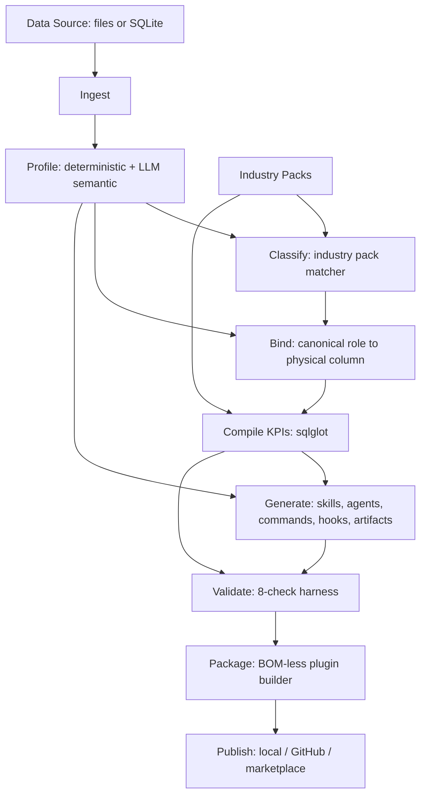

# Architecture

MIS Plugin Forge is a **generator platform**: given a customer's MIS data
source, it produces a complete, installable Claude Code plugin scoped to
that customer's schema and industry. It never hand-codes a plugin for one
customer — every customer-specific artifact is produced by the same pipeline
running against the same generic engine.

## The pipeline



Each stage is a pure function over the previous stage's typed output
(`forge_core/models/`), orchestrated by
[`forge_core/orchestrator.py`](../packages/forge-core/src/forge_core/orchestrator.py)'s
`run_pipeline`. The CLI (`forge run`) and the API (`POST /runs`) both call
`run_pipeline` — there is exactly one pipeline implementation.

1. **Ingest** (`forge_core/ingestion/`) — adapters for CSV/TSV/Excel/JSON/
   NDJSON/Parquet, read-only SQLite, and a read-only live Postgres
   connection (`ingestion/postgres.py`, via DuckDB's `postgres` extension),
   all normalized through DuckDB as a single query surface. Produces a
   `DataSource` with one or more `Table`s. A live-database source has no
   `original_paths` — nothing gets copied into the packaged plugin for it;
   see [security.md](security.md) for how the connection string itself is
   kept out of persisted state and the credential is resolved from the
   customer's own environment at query time.
2. **Profile** (`forge_core/profiling/`) — deterministic per-column stats,
   structural role inference (`identifier`, `currency`, `date`, ...),
   PK/FK/join-candidate detection (name-variant matching + value-overlap
   verification; a `strong`/`weak` strength, empty when the tables are
   unrelated), single- and composite-column grain inference, full value-set
   capture for low-cardinality columns, and statistical pattern mining
   (correlation, monthly temporal trend/seasonality, functional
   dependencies, redundant columns). Then a **mandatory** LLM synthesis pass
   (`profiling/synthesis.py`) turns all of that into `SchemaModel` — the
   knowledge pack: per-table purpose/role/grain, per-column meaning + enum
   decode, actionable pattern notes, and a natural-language→SQL cookbook.
   Every table/column reference is fact-checked against the structural
   profile and every cookbook query is executed once against the real data
   before it is kept. The result is cached on disk by a hash of the
   structural facts, so an unchanged schema is never re-synthesized. No
   provider configured ⇒ the run fails fast; there is no deterministic-only
   fallback.
3. **Classify** (`forge_core/classification/`) — scores every
   `industry-packs/*/signatures.json` against the profile (entity-name
   hints, column-name hints, required canonical roles, table-count range)
   and returns ranked matches. Below the auto-accept confidence threshold,
   the orchestrator pauses (`RunStatus.NEEDS_INPUT`) for a human to pick.
4. **Bind** (`forge_core/binding/`) — the deterministic scorer
   (`scorer.py`) maps each canonical role the chosen pack needs (e.g.
   `revenue_amount`) to a real `table.column` on the one **primary** table,
   using pack-authored hints and token overlap. Whatever it can't resolve,
   an LLM proposer attempts; whatever neither can resolve stays `unresolved`
   and any KPI that requires it is skipped (or the whole run pauses if the
   caller wants to supply overrides — see `binding_overrides`). Pack KPIs
   bind to the primary table only, but **every** ingested table is exposed
   for querying (`allowed_tables`), and verified relationships (possibly
   empty) are carried through for the runtime to serve.
5. **Compile** (`forge_core/compiler/`) — joins each pack KPI's canonical
   SQL template with the resolved bindings, renders concrete SQL, and
   validates it with `sqlglot`. The LLM never touches this step — it only
   ever proposes *bindings*, never SQL that ships as-is.
6. **Generate** (`forge_core/generation/`) — produces the plugin's prose:
   `SKILL.md`, a deep-dive subagent, one slash command per recipe, a
   `SessionStart` guardrail hook, and a static KPI-snapshot dashboard
   computed by actually executing the compiled SQL.
7. **Validate** (`forge_core/validation/harness.py`) — seven checks gate
   packaging (schema fact-check, SQL safety, DuckDB dry-run, plugin-spec,
   the real `claude plugin validate --strict`, an MCP stdio smoke test, and
   an LLM self-critique). A dedicated PII scanner was removed along with the
   `is_likely_pii` heuristic; denied-column enforcement now covers only
   pack-declared role categories (e.g. `free_text`).
8. **Package** (`forge_core/packaging/`) — assembles a `PluginSpec`,
   bundles the generic MCP runtime, and writes a BOM-less, spec-compliant
   plugin directory (see [plugin-format.md](plugin-format.md)). `config/`
   carries `schema_model.json` (the knowledge pack) and `schema_summary.json`
   (structural reference, including each column's guessed role); the old
   `business_context.json` is gone. The MCP runtime loads `schema_model.json`
   and exposes it as `schema://overview|model|relationships|patterns|cookbook|profile`
   resources, and builds the server `instructions` from its overview + caveats.
9. **Publish** (`forge_core/publishing/`) — copy/zip locally, push to a
   customer-specific GitHub repo, or add to a central marketplace catalog.

## Why a generator and not a plugin

The critical architectural decision is that **industry knowledge and
customer schema are two different, independently-varying things**, so they
live in two different files:

- `industry-packs/<slug>/kpis/*.json` — written once, industry-wide, in
  **canonical role** terms (`revenue_amount`, `transaction_status`).
- `config/schema_bindings.json` — generated once per customer, mapping
  those canonical roles to that customer's actual column names.

`forge_core.compiler` is the only thing that turns a canonical KPI +
bindings into runnable SQL, and it's deterministic and `sqlglot`-validated.
This is what lets the same generator run against a healthcare bookings CSV,
a three-table retail orders dataset, and an EdTech SQLite database and
produce three different, fully valid, differently-shaped plugins — see
`tests/e2e/test_genericity.py` for the acceptance test that proves it.

## Repository layout

```text
packages/forge-core/      # the generator engine (every stage above) + CLI (`forge`)
packages/mcp-runtime/     # the one generic MCP server every generated plugin bundles
apps/api/                 # FastAPI service: run orchestration, SSE progress, downloads
apps/web/                 # wizard UI built on top of the API
industry-packs/           # the versioned knowledge base, one directory per industry
plugin-templates/base/    # skeleton a generated plugin starts from
fixtures/                 # sample datasets, golden verified-valid plugins, JSON Schemas, LLM cassettes
generated/                # gitignored — pipeline run output lives here
marketplace/              # publishable marketplace catalog
tests/e2e/                # golden regression + genericity acceptance tests
docs/                     # this directory
```

## Stack

Python 3.13, `uv` workspace, Pydantic v2, Typer, pandas + DuckDB, `sqlglot`,
`mcp[cli]` (FastMCP), `google-genai`, FastAPI + Uvicorn, SQLAlchemy 2 (async)
+ Alembic, pytest; React 19 + Vite + TypeScript + Tailwind + TanStack Query.

See [generator-flow.md](generator-flow.md) for a stage-by-stage walkthrough
with exact module/function pointers, and the top-level [README](../README.md)
for how to actually run it.
