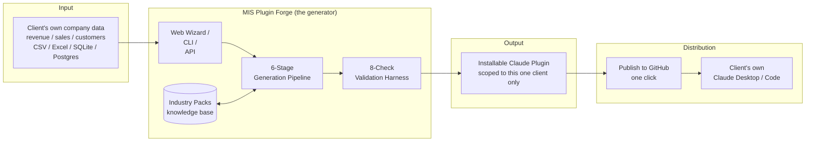
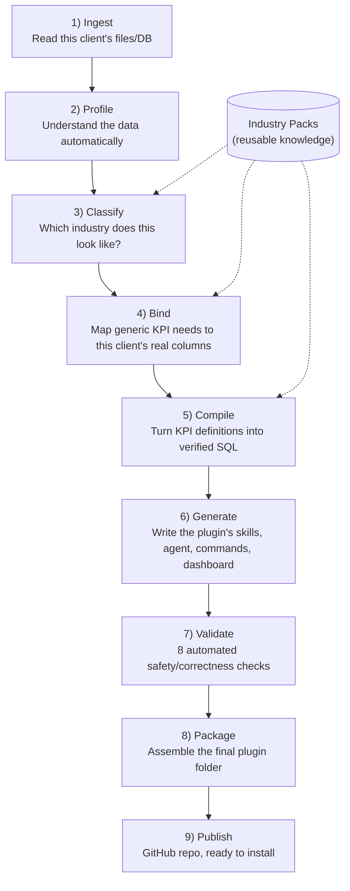
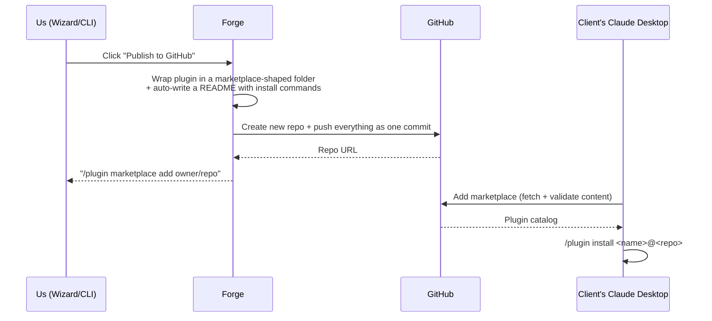

# MIS Plugin Forge — Project Overview for Management

*A plain-language explanation of what we built, why we built it this way, and how it works — with diagrams.*

---

## 1. The problem we were asked to solve

**This is a product we offer to client companies**, not something we run once for ourselves. A client onboards with us, connects *their own* company data — revenue, sales, customer records, bookings, whatever their MIS holds — and in return gets a personalized Claude plugin. From then on, every question they ask Claude about their business ("what's our revenue this quarter", "show me the top accounts") is answered live from *their* data, ideally with clear analytics and visualizations, not just text.

The naive way to build that is: for every client, someone manually writes a Claude plugin that knows that client's specific tables and columns. That doesn't scale — it's one bespoke engineering project per client, forever, and every improvement has to be re-applied to every client's plugin by hand.

**What we built instead is a factory, not a one-off plugin.** A client uploads their data file (or connects a database), and the system automatically produces a complete, ready-to-install Claude plugin scoped to *that client's own data only* — correct column names, correct business terminology, correct KPI formulas — in minutes, with no manual coding per client, and no mixing of one client's data with another's.

---

## 2. The core idea, in one sentence

> **Separate "what a KPI means" (industry knowledge, written once) from "where the data lives" (a specific client's schema, discovered automatically), and let a generic engine combine the two for any client, in any industry, automatically.**

Everything else in the system exists to make that one idea safe, repeatable, and trustworthy enough to actually ship to a paying client.

---

## 3. High-level architecture

We built **three ways to drive the same engine** — a command-line tool, a REST API, and a web wizard — but there is only **one pipeline implementation** underneath all of them, so there's nothing that works in the UI but not the CLI, or vice versa. Every run is scoped to one client's data; nothing is pooled or shared across clients.

---

## 4. The generation pipeline, explained like a story

Think of it as an assembly line with nine stations. A client's dataset goes in one end; that client's own working plugin comes out the other.

**1. Ingest** — We accept CSV, TSV, Excel, JSON, Parquet, a SQLite file, a zip of several files, or a live read-only Postgres connection. Everything is normalized through one query engine (DuckDB) so the rest of the pipeline never has to care what format the client's data started in.

**2. Profile** — Before we know anything about the client's business, we look at the data itself: what type is each column (a date? a currency amount? an ID?), which columns look like primary/foreign keys, how tables join to each other, what a typical row looks like. This is done deterministically (fast, free, no AI) with an optional AI pass on top that adds plain-English business context (using only column names and small, capped samples — never bulk client data).

**3. Classify** — We compare that profile against a library of **industry packs** (healthcare, retail, sales-pipeline, etc. — each one is just a folder of JSON files) and score how well each one matches this client's data. If nothing matches confidently, the system pauses and asks a human to confirm — it never silently guesses wrong on a real client's data. There's also a built-in "generic analytics" pack as a safe fallback for data that doesn't fit a specialized industry.

**4. Bind** — This is the heart of the reusability trick. An industry pack defines a KPI like "revenue" in **abstract terms** ("the column that plays the role of `revenue_amount`"), never in terms of one client's actual column name. The binder's job is to figure out, for *this* client, which real column plays that role — e.g. `sales_pipeline.close_value` — using naming hints from the pack plus an AI assist for anything ambiguous. Nothing is left to guesswork: unresolved mappings mean that KPI is simply skipped for this client rather than guessed.

**5. Compile** — Once we know "`revenue_amount` = `sales_pipeline.close_value`" for this client, we combine that with the pack's KPI *formula* to produce real, executable SQL — and we validate that SQL with a dedicated SQL parser (`sqlglot`) before it ever runs. **The AI never writes SQL that ships to a client as-is** — it only ever proposes column mappings, which are then compiled deterministically.

**6. Generate** — Now we write the actual plugin content: a skill document describing what the assistant can do, a specialist sub-agent for deep-dive analysis, one slash-command per common report, a session-start guardrail (e.g. "this data is read-only, never guess at PII"), and a small HTML dashboard pre-computed from the client's real KPI numbers.

**7. Validate** — Nothing reaches a client without passing **eight independent automated checks**: every fact we generated is grounded in the real schema, every SQL statement is provably read-only and safe, a dry-run actually executes against the real data, a PII scanner checks nothing sensitive leaked into generated text, the plugin file structure matches Claude's exact spec, the real `claude` CLI's own validator approves it, the bundled MCP server smoke-tests successfully, and (optionally) an AI self-critique pass reviews the output for quality issues a machine check wouldn't catch.

**8. Package** — Assemble everything into the exact folder structure Claude Code/Desktop expects (manifest, skills, agents, commands, hooks, bundled server, and the client's data — with sensitive columns automatically redacted before anything is bundled).

**9. Publish** — See section 6 below.

---

## 5. What actually goes *inside* a generated plugin

A common question was: "is this just a pile of JSON, or is there real code?" Both — deliberately. Every generated plugin is a folder with the same nine kinds of pieces in it, every time:

| Piece | Folder | What it is | Why it exists |
|---|---|---|---|
| **Manifest** | `.claude-plugin/plugin.json` | A small JSON file: plugin name, version, author, and where everything else below lives. | The one file Claude Code/Desktop reads first to know what the plugin contains. |
| **Skill** | `skills/<pack>-analyst/SKILL.md` | One Markdown file (with structured YAML metadata on top) per client, describing *when* to use this plugin and *what KPIs it knows about*. | This is the file that teaches the assistant "when someone asks about revenue/sales/bookings for this client, here's the catalog of pre-built KPIs available and how to fetch them" — it's the plugin's table of contents. |
| **Agent** | `agents/<pack>-analyst.md` | A specialist "deep-dive analyst" persona — a system prompt plus a locked-down list of tools it's allowed to call. | For open-ended, multi-step analysis questions, rather than the general assistant, this dedicated persona is instructed to only ever answer using real tool calls, never a guessed number, and to always cite which KPI or query produced each figure. |
| **Commands** | `commands/<recipe>.md` | One slash-command per common report (e.g. `/quarterly-summary`) — a short, ready-made recipe that runs every relevant KPI and summarizes the results. | Gives the client one-click access to the reports they'll ask for most often, instead of having to phrase a question from scratch every time. |
| **Hooks** | `hooks/hooks.json` | A small config that fires automatically at session start — it reminds the assistant of this client's guardrails (e.g. "this data is read-only," "never infer PII") before any question is even asked. | Deterministic and never AI-authored, on purpose — it controls what runs automatically, so it can't be left to chance or a bad AI-generated instruction. |
| **MCP server config + code** | `.mcp.json` + `mcp_server/` | `.mcp.json` tells Claude how to start the server (`python run_server.py`); `mcp_server/` is the actual Python code that runs and answers tool calls against this client's real data. | This is the plugin's only real executable logic, and it's **generic** — the exact same code for every client, written once and reused, never regenerated per client. It exposes five tools: • `describe_schema` — lists tables/columns/types only, never row-level data • `get_kpi` — the preferred way to get a number: looks up one of the client's pre-validated KPIs by id and runs it • `run_safe_query` — the one tool that accepts free-form SQL from the assistant, but only after it passes a chain of guardrails (must be read-only `SELECT`, only allowed tables, no denied/PII columns, row-limit and timeout enforced) • `search_records` — constrained lookups against one allowed table, with column/table names validated and filter values always passed as safe bound parameters, never string-interpolated • `get_data_profile` — per-column data-quality stats (null %, cardinality), from a pre-computed, PII-scrubbed summary |
| **Config data** | `config/*.json` | Four small JSON files generated once per client: `data_source.json` (which tables/columns exist), `schema_bindings.json` (this client's canonical-role-to-column map), `kpi_defs.json` (the compiled, validated SQL per KPI), `schema_summary.json` (a PII-scrubbed structural summary). | This is the "what this client's data means" fact base the MCP server reads at runtime — it's what makes the same generic server behave correctly for a different client with different column names. |
| **Dashboard artifact** | `artifacts/dashboard.html` | A single static HTML page, pre-computed once at generation time by actually running the client's real compiled KPI SQL. | Gives the client something to open immediately after install, with real numbers, before they've asked a single question — see Section 6 for how this evolves into full chart-based visualizations. |
| **Data** | `data/*.csv` (or a live DB connection, no files) | The client's own data, bundled only for file-based sources, and only *after* PII/sensitive columns have already been stripped. | Lets the bundled MCP server query real numbers locally; for a live database connection, nothing is bundled here at all — the plugin connects out to the client's own database instead. |

So, by design: everything AI-authored or client-specific is declarative text or data (safe, reviewable, no arbitrary code-execution risk); the one piece of real executable logic — the MCP server — is generic, hand-written once, and shared unchanged across every client.

---

## 6. The analytics experience: what's live today vs. the "beautiful charts" vision

The end goal is: a client asks any question, in plain English, and gets back a clear, visual answer — charts and graphs, not walls of numbers. It's worth being precise with you about where we actually are against that today:

**Built and working today:**
- **Live, correct numbers for any supported KPI**, on demand, via the plugin's bundled tools (`get_kpi`, `run_safe_query`) — the assistant can answer numeric and tabular questions accurately against the client's real, current data.
- **A pre-computed KPI snapshot dashboard** (a static HTML page bundled with the plugin), rendered as clean tables, generated once at plugin-creation time from real data.

**Not yet built — the gap between today and "beautiful charts for every ask":**
- Today's dashboard is **tables, not charts** — no bar/line/pie visualizations yet.
- There's no dedicated **chart-rendering layer** that turns an arbitrary ad-hoc question into a graph on demand; today the assistant answers in text/tables using its own general ability, not a purpose-built visualization tool we generated.

This is a well-scoped next phase, not a redesign — the hard part (getting the *right numbers*, safely, per client) is done; what's left is a rendering layer on top of numbers we already compute correctly. See `docs/project-plan.md` for how this is sequenced as a next phase.

---

## 7. Publishing: one click from "generated" to "installable by that client"

Once a run succeeds, one click:
1. Wraps the plugin in a self-contained marketplace structure.
2. Writes a README with the exact install commands.
3. Creates a brand-new GitHub repository (one per client) and pushes everything as a single commit.
4. Hands back the two commands the client needs to install it in their own Claude Desktop/Code — no manual packaging, no manual repo setup on our side.

---

## 8. How we made this trustworthy enough to ship to a paying client

A generator that produces client-facing plugins automatically is only useful if we can trust its output *without* manually reviewing every client's plugin by hand before they see it. Three design decisions do that:

- **The AI never writes code that runs.** It only proposes column mappings and business-context summaries. All executable SQL is generated deterministically from a validated template and re-checked by a real SQL parser.
- **Every generated fact is grounded.** The validation harness cross-checks every claim in the generated text against the client's actual schema/data — an unverifiable claim fails the build.
- **PII protection is automatic, not manual.** Sensitive columns are identified and redacted from the bundle *before* anything is packaged, and a dedicated scanner double-checks nothing sensitive leaked into generated text.

---

## 9. Delivery approach (milestones)

We built this in incremental, independently-testable milestones (M0 → M12), each with its own passing tests, rather than one big-bang implementation:

| # | Milestone | What it delivered |
|---|---|---|
| M0 | Foundation | Project skeleton, workspace, linting/type-checking/tests wired into CI |
| M1 | Contracts | The typed data models every stage agrees on |
| M2 | Ingestion | File/SQLite/Postgres adapters, unified through DuckDB |
| M3 | Profiling | Deterministic column/table profiler + optional AI semantic layer |
| M4 | Industry packs | The pack format + the classifier that matches a dataset to one |
| M5 | Binding & compiling | Canonical-role-to-column mapping + SQL compilation |
| M6 | Generic MCP runtime | The one executable server every plugin uses |
| M7 | Generation | Skills, agents, commands, hooks, dashboard authoring |
| M8 | Validation harness | The eight-check trust gate before anything is packaged |
| M9 | Packaging & publishing | Final plugin assembly + GitHub/marketplace publishing |
| M10 | API | FastAPI service wrapping the pipeline as async jobs with live progress |
| M11 | Web UI | The wizard: connect → review profile → confirm industry → review bindings → generate → validate → publish |
| M12 | End-to-end tests & docs | Acceptance tests proving the *same* engine works across different industries/client datasets, plus full documentation |

All twelve milestones are complete and covered by automated tests (unit + end-to-end). The rich-visualization layer (Section 6) is the next milestone, not yet started.

---

## 10. Tech stack (for reference)

- **Generator engine & API:** Python 3.13, Pydantic v2, DuckDB, `sqlglot`, FastAPI, Google Gemini (for the AI-assisted steps only)
- **MCP runtime:** Python, Anthropic's official MCP SDK (FastMCP)
- **Web UI:** React 19, TypeScript, Vite, TanStack Query
- **Distribution:** GitHub (Git Data API for atomic multi-file publishing), Claude Code/Desktop plugin marketplace format

---

## 11. One-line summary for the exec summary slide

> *We built a generator — not a one-off plugin — that turns any client's raw company data (revenue, sales, customers) into a fully working, safety-validated Claude plugin automatically, and publishes it to a ready-to-install GitHub repository in one click, with no per-client manual engineering. Live, correct analytics are working today; rich chart-based visualization for any ad-hoc question is the next planned phase.*
