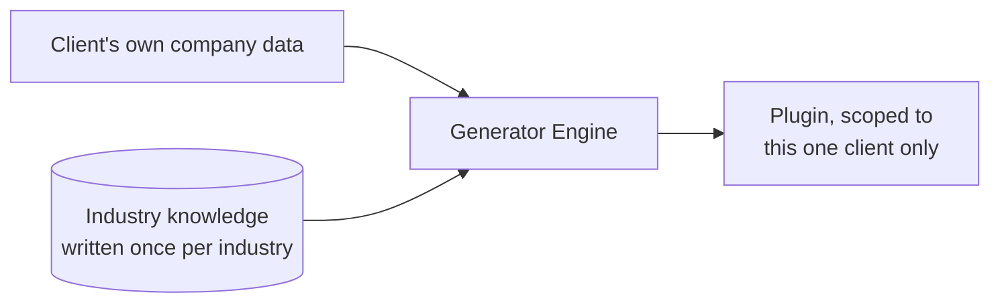
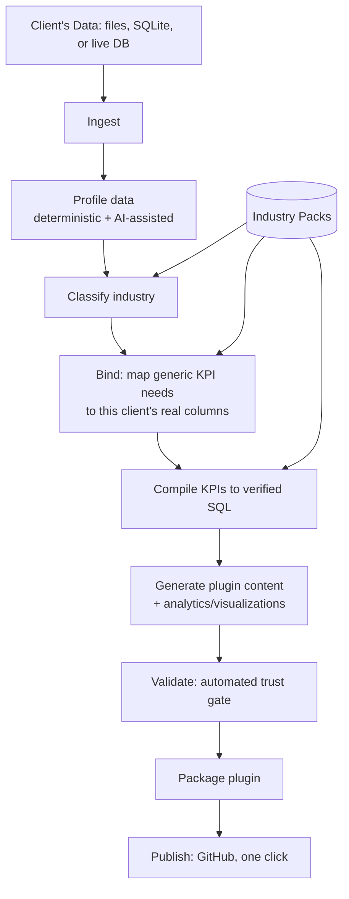

# Data2plugin — Project Plan

*Written as if presenting this before a single line of code exists: the problem, the proposed approach, the phased plan, the risks, and how to walk a manager through it.*

---

## 1. The ask, restated as a problem

> "We want to offer this to client companies: a client connects *their own* company data — revenue, sales, customer records — and gets back a Claude plugin. From then on, every question they ask Claude about their business should be answered from their own data, with clear analytics and visualizations, not just text."

If we take that literally and hand-build **one plugin per client**, cost scales linearly with the number of clients, forever, and every bug fix or improvement has to be re-applied to every client's plugin individually. That's not a scalable product — it's a services business wearing a product's clothes.

**Goal:** build something once that can onboard *any* client's tabular MIS data, in *any* of a set of supported industries, and produce a correct, safe, installable Claude plugin, scoped strictly to that one client's own data — with no bespoke engineering per client, and no mixing of one client's data with another's.

---

## 2. Proposed approach (the pitch, one slide)

> **Build a generator, not a plugin.** Separate "what a KPI means" (written once, per industry) from "where this client's data lives" (discovered automatically, per client). A deterministic engine combines the two for any client, automatically.

Two things make this safe enough to actually automate, which we'll come back to under risks:
- The AI in the loop only ever *proposes* — column-name interpretations, business-context blurbs. It never writes code or SQL that ships to a client as-is.
- Nothing reaches a client without passing an automated validation gate, so we don't need to manually review every client's output by hand before they see it.

---

## 3. Proposed architecture

Three interfaces (CLI, API, web wizard) will all call the *same* pipeline — we will not maintain parallel logic in a UI layer and a backend layer. Every run is scoped to exactly one client; nothing is pooled or shared across clients' data.

---

## 4. Guiding principles (the non-negotiables to agree with the manager up front)

1. **One engine, not N plugins.** Every client-specific artifact comes out of the same code path.
2. **Industry knowledge is data, not code.** Adding a new industry means adding a new folder of JSON, not writing a new pipeline.
3. **The AI proposes, it never ships unchecked.** Anything that executes (SQL) is deterministically compiled and parser-validated; the AI only assists ambiguous column-mapping and prose.
4. **Nothing ships without passing an automated trust gate.** We will not rely on a human manually reviewing every generated client plugin before release.
5. **PII protection is automatic, not a checklist item someone might forget.** Sensitive columns are identified and stripped before packaging, by code, every time.
6. **One client, one plugin, one dataset.** A generated plugin only ever sees and answers from the client it was generated for — no cross-client data ever enters the same plugin or the same conversation.

---

## 5. Phased delivery plan

Rather than one big-bang build, we'll deliver in phases, each independently demoable and tested before moving on. This lets us surface architecture problems early (e.g., "does this really generalize across industries?") instead of at the end.

| Phase | Objective | Key deliverables | Exit criteria |
|---|---|---|---|
| **0. Foundations** | Get the project scaffolding and quality bar in place before writing feature code. | Repo/workspace structure, linting, type-checking, CI, test scaffolding. | `pytest`/CI green on an empty-but-structured repo. |
| **1. Contracts** | Agree the data shapes every stage will pass to the next, before building the stages. | Typed models for schema profiles, industry packs, KPI defs, plugin spec. | Every later phase can be written against these types without churn. |
| **2. Ingestion & Profiling** | Read a client's data and understand its shape automatically. | Adapters for CSV/Excel/JSON/Parquet/SQLite/Postgres via one query engine; deterministic column/table profiler; optional AI semantic layer. | Can point the tool at an arbitrary client dataset and get back a structured profile with no manual input. |
| **3. Industry Intelligence** | Encode "what a KPI means" once per industry, and detect which industry a client's dataset matches. | Industry pack format (entities, KPIs, guardrails); classifier that scores a profile against every pack; a safe generic fallback pack. | Feeding two different clients' datasets from two different industries returns two different, correct pack matches (or a safe fallback + human confirmation when ambiguous). |
| **4. Binding & Compilation** | Turn "what a KPI means" + "this client's actual columns" into runnable SQL. | Deterministic + AI-assisted column-role binder; SQL compiler validated with a real SQL parser. | The same industry pack, run against two structurally different clients' data, produces two different but both-correct sets of SQL. |
| **5. Generation** | Author the plugin's actual content — the parts the client sees and interacts with. | Skill/agent/command authoring, session guardrail hooks, a pre-computed KPI dashboard. | Generated content is grounded in and cites only that client's real schema facts. |
| **6. Validation Harness** | Build the automated gate that lets us trust unreviewed, automated output before a client ever sees it. | Schema fact-checking, SQL safety checks, real dry-run execution, PII scan, plugin-spec structural validation, the platform's own CLI validator, an MCP smoke test, AI self-critique. | A deliberately-broken plugin fails the gate; a correct one passes all checks. |
| **7. Packaging & Publishing** | Turn validated output into something installable, and get it into the client's hands. | Plugin packager matching the platform's exact spec; one-click publish to a new, client-specific GitHub repo with auto-generated install instructions. | A generated plugin installs successfully in a real Claude Desktop/Code session end-to-end. |
| **8. Interfaces** | Make the engine usable by non-engineers, including client-facing onboarding. | FastAPI service with async jobs + live progress; a web wizard (connect → review → confirm → generate → validate → publish). | A non-engineer can take a client from "here's our CSV" to "here's your install link" without touching a terminal. |
| **9. Hardening & Proof** | Prove genericity across clients, not just "it worked once." | End-to-end acceptance tests across multiple industries/client-shaped datasets; full documentation. | The same, unmodified engine is proven — by an automated test, not a demo — to produce correct output for client data it has never specifically been tuned for. |
| **10. Rich Visualization Layer** *(next up, not yet built)* | Turn "correct numbers" into "beautiful charts," for any ad-hoc question a client asks — not just the fixed KPI list. | A chart-rendering layer (bar/line/pie/trend as appropriate) driven by the same validated KPI/query results already computed in Phases 4–6; extend the dashboard artifact and the live tool responses to return chart-ready output, not just tables. | Asking an arbitrary business question in the installed plugin returns a rendered chart, not just a number or a table, without any manual work per client. |

**Sequencing logic:** Phases 0–4 build the "brain" (understand data, know what a KPI means, map one to the other) before Phase 5 spends any effort on "how it looks" — there's no point generating polished plugin content against bindings that might be wrong. Phase 6 (validation) is deliberately built *before* we lean on it in Phase 7 (publishing) — we want the safety net in place before anything goes out the door to a client. Interfaces (Phase 8) come after the engine works headlessly via CLI, so the UI is a thin layer over proven logic, not the thing carrying unproven logic. Phase 10 (visualization) is sequenced last on purpose: it's much cheaper to build a rendering layer on top of numbers we already know are correct per-client than to build charts against numbers we don't yet trust.

---

## 6. Risks and how the plan addresses them

| Risk | Mitigation baked into the plan |
|---|---|
| "It only works on the one demo dataset we tuned it against." | Phase 9 is an explicit, automated genericity test across multiple industries and client shapes — not a demo script. |
| AI hallucinates a wrong KPI formula or column mapping and it silently ships to a client. | AI never writes shipped SQL directly (Phase 4); everything is deterministically compiled and validated (Phase 6) before packaging. |
| Sensitive client data (PII) ends up bundled into a plugin or described in generated text. | Automatic redaction before packaging + a dedicated PII scanner in the validation gate (Phase 6), not a manual checklist. |
| One client's data or plugin accidentally becomes visible to another client. | Every run and every generated artifact is scoped to exactly one client end-to-end (Guiding principle #6); each client gets their own dedicated repo/plugin, never a shared one. |
| Classifier picks the wrong industry for an ambiguous client dataset. | Low-confidence matches pause for human confirmation rather than silently guessing; a safe "generic analytics" fallback always exists. |
| A generated plugin looks fine in our tests but fails the *actual* installation platform's own rules. | Phase 6 shells out to the real platform CLI validator, not just our own model checks, as a gating step. |
| Clients expect "beautiful charts for every question" from day one, but that's a later phase. | Set expectations explicitly: Phases 0–9 deliver correct, live, text/table analytics; Phase 10 is scoped and sequenced as the dedicated visualization layer, not bundled vaguely into "generation." |
| Engineers build a nice CLI but the API/UI reimplements slightly different logic, and they drift apart. | Guiding principle #1 — one pipeline function, called by CLI, API, and UI alike. |

---

## 7. What "done" looks like (definition of success)

- Point the tool at a new client's dataset it has never seen, in an industry it has a pack for → get back a correct, installable plugin scoped only to that client, with no manual intervention.
- Every generated plugin passes the same automated validation gate — no plugin ships to a client on the strength of a manual review alone.
- Adding support for a new industry is "add a folder of JSON," not "write new pipeline code."
- A non-engineer can complete the full client onboarding journey (upload data → get an install link) through the web wizard alone.
- *(Phase 10 target)* A client can ask an arbitrary business question and get back a rendered chart, not just a number.

---

## 8. How to present this to your manager

A suggested structure for the conversation/deck, in order:

1. **Lead with the business problem, not the tech.** "We want to offer every client a personalized analytics plugin for their own data, without hand-building an integration per client. That doesn't scale as a services model." One sentence, no jargon.
2. **State the one-sentence idea next.** "So instead of building plugins one by one, we're building a machine that builds a plugin per client — industry knowledge written once, each client's schema discovered automatically." This is the sentence that makes the rest of the plan make sense.
3. **Show the architecture diagram** (Section 3) — a manager doesn't need the nine internal pipeline stages, just: client data goes in, engine + knowledge base combine, that client's plugin + safety gate come out, published automatically.
4. **Walk the phases as a table, not a narrative.** Managers read phase/deliverable/exit-criteria tables faster than prose; it also visibly proves this wasn't a big-bang gamble, and makes clear where "beautiful charts" (Phase 10) sits relative to what's already solid.
5. **Spend real time on Section 6 (risks).** This is usually the part managers actually probe — showing you pre-identified "AI hallucination," "PII leakage," "cross-client data leakage," and "wrong industry match" as risks *with a specific mitigation already designed in*, rather than being asked about them and improvising, is what builds confidence in the approach.
6. **Be explicit about the visualization gap.** If the manager (or the client pitch) is leading with "beautiful charts for every question," say plainly: the numbers are live and correct today (Phases 0–9); the chart-rendering layer is the next scoped phase (Phase 10), not yet built. Overselling this now is the fastest way to lose credibility at the first client demo.
7. **Close with Section 7 (definition of done)** so the conversation ends on a concrete, checkable bar rather than a vague "it should work well."
8. **Have `docs/manager-overview.md` ready as the follow-up leave-behind** — it covers the same ground in more narrative detail, with the as-built diagrams and an honest "what's live vs. what's next" section, for anyone who wants to read after the meeting rather than during it.

If your manager asks "why not just hand-code plugins for our first few clients and generalize later" — the honest answer, worth having ready, is: the binding/compilation split (Phase 4) and the validation gate (Phase 6) are the expensive, hard-to-retrofit parts of this system. Building them from the start against a *generic* client-schema model is cheaper than building them once against one client's hard-coded schema and then having to generalize them afterward — and it's what lets Phase 10's chart layer benefit every client at once instead of being rebuilt per client too.
